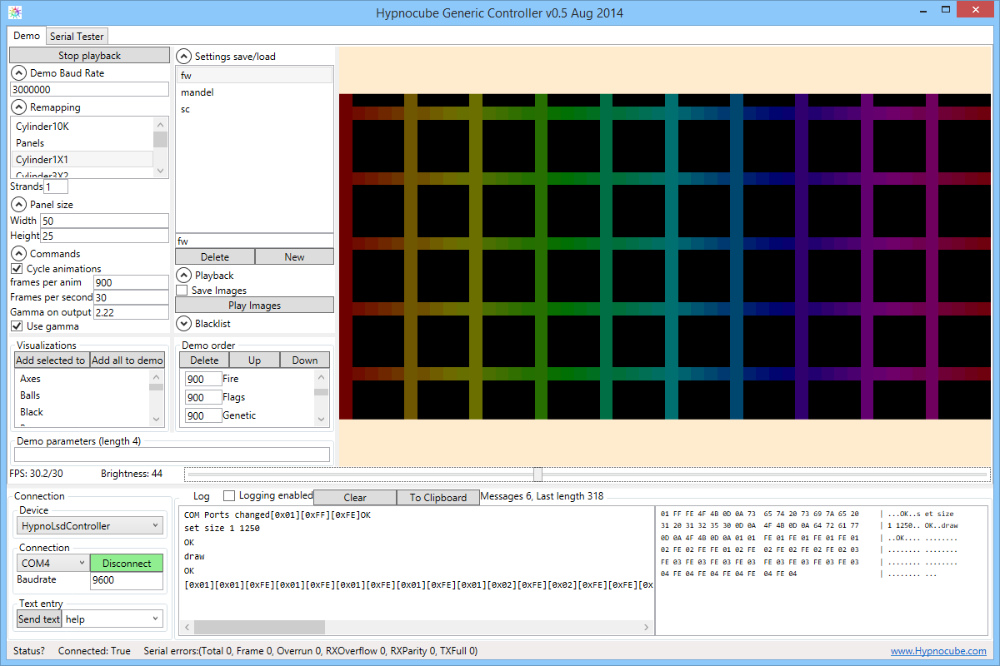
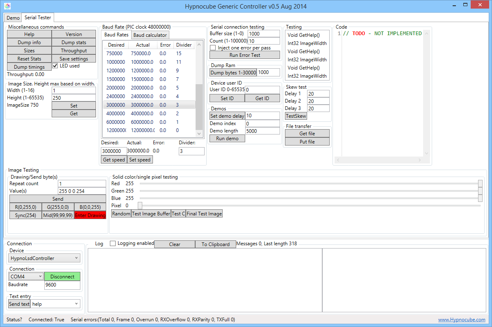

# HypnoController

[**Who we are**](#who-we-are) **|** 
[**Using the program**](#using-the-program) **|** 
[**Compiling**](#compiling) **|** 
[**Downloads**](#downloads) **|** 
[**Miscellaneous**](#miscellaneous) **|** 
[**License**](#copyright-and-license)

*******************************************************************************

The HypnoController is a sample application developed internally for testing and using certain devices made by [Hypnocube, LLC.](http://hypnocube.com/). Currently it supports the [Hypnocube LED Serial Driver](http://hypnocube.com/product/led_serial_driver/) (pictured below), which is a hardware controller for large numbers of WS2811/WS2812 LEDs. We developed this software for developing and testing several projects, and it is now merged with our custom demo making software. We used this to make the YouTube [video showing off the device capabilities](https://www.youtube.com/watch?v=SzpcPrnh9LY). We have several other devices under development that will also integrate with this codebase when they are released. For some useful notes on designing and building hardware, see our posts "Design and Implementation of Serial LED Gadgets [Part I](http://hypnocube.com/2013/12/design-and-implementation-of-serial-led-gadgets/) and [Part II](http://hypnocube.com/2014/07/design-and-implementation-of-serial-led-gadgets-part-ii/). Here is what the HypnoLSD looks like:

The HypnoController currently has two main components: the [Demo controller](#demo-controller) and the [Serial tester](#serial-tester).

## Who we are

We are the makers of the [Hypnocube](http://hypnocube.com/), a 4x4x4 LED light art gadget, as well as some other similar devices. We wanted to release some code for people to play with and make it easier to interact with our upcoming devices. Our most famous gadget is the 4x4x4 Hypnocube:

## Using the program

The program has two main views at the moment, a demo tab for creating graphics to play back on whatever physical LED artwork you create, and a serial tester view, which helps interact with our HypnoLSD module.

In the lower right is where you select a connection to the device by selecting a COM port, an initial baud rate (the HypnoLSD defaults to 9600 baud), then pressing connect. You cal also select a type of device to connect with; for now the only supported device is the HypnoLSD module.

A combobox allows you to type in text commands to send to the device.

A log pane tracks communications, allowing seeing the text and binary communications with the device. 

### Demo controller

After connecting, the demo tab allows selecting of the various built in demo modules, scheduling the desired frame rate, length of each demo, order of each demo, and parameters.

When a demo runs, this log is disconnected via the checkbox to prevent too much data being sent through the logger, slowing down the demos.

To play a demo through a connected device, select a remapper, which maps the (currently) 2D demos to an layout for your device, select some demos, and press start. You can save/load collections of settings via tha save/load portion. These are stored in the file HCDemoSettings.txt file in the user documents directory under the Hypnocube/HypnoDemo directory.
  

#### New remappers
A remapper takes a 2D image and maps it to whatever output layout you have constructed. There are several built in ones for devices we have built internally for play/testing/show. To create new ones, look in the HypnoDemo/Model/Remappings directory and look through a few. Adding them is as simple as creating a new class, deriving from Remapper, and implementing the interface. A very nice generic one called Panels allows some simplification for certain panel based layouts; see Cylinder1x1 for example, which is a slightly curved panel we built consisting of one strand of LEDs arranged in a 50x25 array on a board, with the ends wrapping back and forth. Using the functions exported by Panels it is easy to add such remappers.

New remappers will be detected by the system through reflection, so there is nothing else to do.

#### New demo modules

All the demo effects are in the HypnoDemo/Model/Demos folder, and each is (mostly) a self contained graphics effect, derived from DemoBase, which provides basic drawing/timing/random number/etc. services. Each demo needs a constructor with the width and height of the image to be generated, which calls the base constructor with the same parameters. Demos should run at arbitrary resolution to be as portable across devices as possible. The only other requirement is overriding the Update function to draw frames. Digging through the DemoBase and Surface classes shows a lot of the functions available, as does investigating demo classes.

### Serial tester

The serial tester pane allows interacting with the HypnoLSD module, supporting most (all?) of the features. After connecting you should be able to press help and have the device reply through the logging pane (make sure logging is enabled). The rest of the features are described in the [Hypnocube LED Serial Driver manual](http://hypnocube.com/wp-content/uploads/2014/07/HypnoLSD-User-Manual.pdf). 

Perhaps the most useful ability is setting the gadget settings (baud, demo timing, ID, etc.) and storing them into flash, so the device powers on in the mode you want.

### Installing
To use, just copy the output (bin/Release or bin/Debug as desired) directory to wherever you want, and execute the HypnoController.exe application.

This is a Visual Studio 2013 project. Source is provided as is. Executables (both debug and release, overwriting any previous ones) are put in the Staging directory.

### Uninstalling
To uninstall, delete whatever directory you put the executables in, and any directories you no longer want in your documents folder under the Hypnocub subdirectory.

## Compiling

The code is available from GitHub.

The codebase is a C#/WPF application comprising about 36,000 lines of C# and 1,000 lines of XAML, which currently is compiled under Visual Studio 2013. We do not plan on supporting other compilers, although it is possible the free editions will compile this correctly. We have not tested that yet.

Currently the code requires WPF, so will not work under Mono, but if someone adds decent changes to support WinForms we will integrate them (as long as they do not impact our ability to extend the WPF code), making the application work on a larger range of devices.

## Downloads

The code builds into the [Staging](Staging) directory, so copying out everything from there into a directory on your machine allows using the binaries without having to compile them.

## Miscellaneous

### Hacking and extending

The code is laid out in several projects:
 
| Project           | Description       |
|-------------------|-------------------|
| HypnoController   | The main GUI, holds other components.                               | 
| HypnoDemo         | The code for the demo component, including all the graphics demos.  |
| HypnoSerialTester | The code for the serial tester.                                     |
| LibHypnocube      | General library code used in other places                           |
| Devices           | under the Device directory are where new supported hardware devices will go. The only one currently is the HypnoLSD controller. |

See the section [using the program](#using-the-program) for tips on extending the code.

### Bugs and Feature Requests
Send them to us, but we're busy and may not get to them, but we will add them to a list and each time we take a pass on this code we will do anything that we find suitable.

### Release History
* 0.5 - Aug 2014 - Initial release to the public

### TODO
* Set final black image on demo shutdown
* Many more TODOs are scattered throughout the code :)

### Contributing

If you want to make changes or extend this code, feel free to do so, and if you tell us about them, we will integrate any we feel suitable back into this official location. Follow our website for upcoming and new devices.

### Creators

This code was written by Chris Lomont. The HypnoLSD device and other hardware were designed by Gene Foulk. So send software questions to Chris, and hardware questions to Gene - that makes things easier :)

**Chris Lomont**

- Email: [chris@hypnocube.com](mailto:chris@hypnocube.com)
- [Personal website (outdated)](http://www.lomont.org)

**Gene Foulk**

- Email: [gene@hypnocube.com](mailto:gene@hypnocube.com)

## Copyright and License

This code released under the [MIT license](LICENSE), which means do whatever you want as long as you maintain our copyright notices, and if anything goes wrong, it's your fault :)

THE END :)